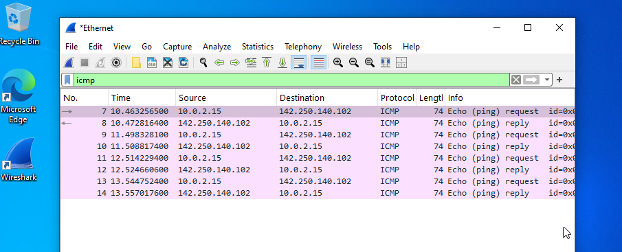
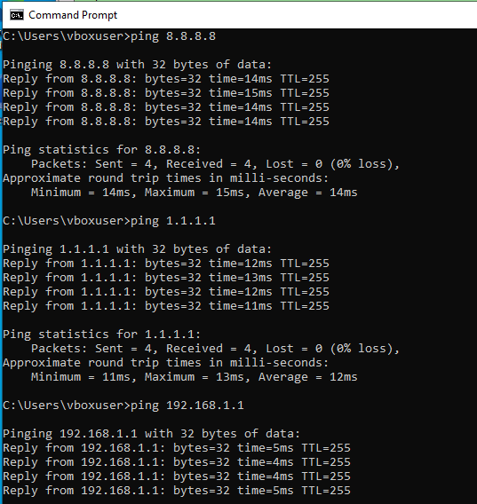
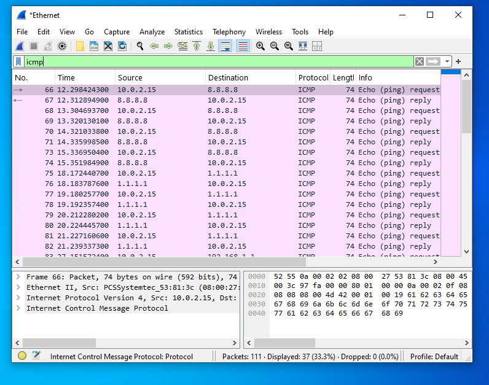

# 🌐 Network Attack Investigation (Wireshark)

## 🎯 Objective
The goal of this lab is to capture and analyse network traffic using Wireshark and identify patterns that may indicate suspicious or malicious behaviour.

---

## 🧠 What is Network Traffic?

Network traffic refers to:
> Data packets sent between devices over a network.

Each packet contains:
- Source (who sent it)  
- Destination (where it’s going)  
- Protocol (how it’s sent)  

---

## 🧪 Lab Setup

- Tool used: Wireshark  
- Environment: Windows Virtual Machine  
- Traffic generated using Command Prompt  

---

## 🧪 Step 1 — Capture Traffic

- Open Wireshark  
- Select the **Ethernet interface** (used in virtual machines instead of Wi-Fi)  
- Start capturing packets  

---

## 🧪 Step 2 — Generate Normal Traffic (Baseline)

```cmd
ping google.com
```

---

## 🔍 Observation (Baseline Traffic)

- ICMP Echo Requests (sent from local machine)  
- ICMP Echo Replies (received from external server)  
- Communication between:
  - Local IP (e.g. 10.0.2.15)  
  - External IP (e.g. Google servers)  

---

## 🧠 Interpretation

This represents:
> Normal connectivity testing behaviour.

---

## 🧪 Step 3 — Filter Traffic

Apply the following filter in Wireshark:

```
icmp
```

---

## 🎯 Purpose of Filtering

Filtering helps to:
- Focus on specific protocols  
- Reduce unnecessary noise  
- Identify patterns more clearly  

---

## 🧪 Step 4 — Generate Suspicious Behaviour

```cmd
ping 8.8.8.8
ping 1.1.1.1
ping 192.168.1.1
ping 192.168.1.2
```

---

## 🔍 Observation (Suspicious Pattern)

- Multiple destination IP addresses  
- Repeated ICMP requests  
- Traffic occurring within a short timeframe  

---

## 🚨 Indicators of Suspicious Activity

- Rapid ICMP requests  
- Multiple different IP addresses targeted  
- Sequential IP patterns (possible scanning)  
- Unusual behaviour for a normal user system  

---

## 🧠 Important Concept: Context Matters

Seeing multiple IP addresses alone does **not always indicate an attack**.

---

### ✅ Normal Behaviour Examples

- Web browsing (multiple servers contacted)  
- Background applications and services  
- Content delivery networks (CDNs)  

---

### 🚨 Potentially Malicious Behaviour

- Sequential IP scanning  
- High-frequency ICMP requests  
- Probing multiple hosts rapidly  

---

## 🧠 SOC-Level Analysis
Multiple ICMP requests to different IP addresses within a short timeframe may indicate reconnaissance activity, depending on the context and expected system behaviour.

---

## 🧠 What is Reconnaissance?

Reconnaissance is:
> The process of discovering active systems on a network before launching an attack.

Attackers use this to:
- Identify live hosts  
- Map the network  
- Select targets  

---

## 🛡️ Detection Strategy

Security analysts detect suspicious activity by analysing:

- Traffic patterns (not just individual packets)  
- Timing of requests  
- Behaviour compared to normal system activity  

---

## 💥 Key Takeaways

- Wireshark allows real-time packet capture and analysis  
- ICMP traffic can help identify scanning behaviour  
- Multiple IP addresses are not always malicious — context is key  
- Pattern recognition is critical in network investigations  
- Understanding attacker behaviour improves detection accuracy  

---

## 🔥 Skills Demonstrated

- Packet capture and analysis  
- Network protocol understanding (ICMP)  
- Traffic filtering and investigation  
- Detection of reconnaissance activity  
- Blue Team / SOC analyst mindset  
